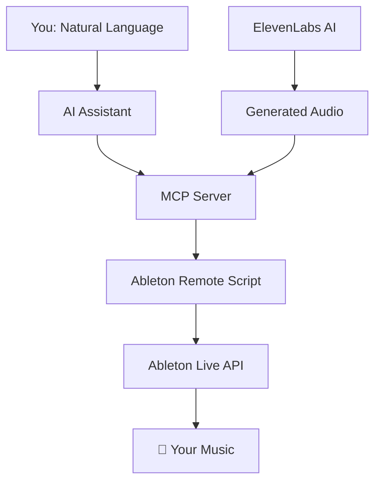

# Ableton MCP Extended
**Control Ableton Live using natural language via AI assistants like Claude, Gemini, or Cursor.**

[](https://opensource.org/licenses/MIT)
[](https://www.python.org/downloads/)
[](https://www.ableton.com/)

---
## 🎬 Overview
This tool is designed for producers, developers, and AI enthusiasts who want to streamline their music production workflow, experiment with generative music, and build custom integrations with Ableton Live through the **Model Context Protocol (MCP)**.

[Watch the Video Demonstration](https://www.youtube.com/watch?v=7ZKPIrJuuKk)

### **The Workflow**
```
👤 "Create a minimalist neo-classical composition similar to Ólafur Arnalds."
🤖 "Creating MIDI clips... Adding effects... Done!"
👤 "Generate a poem in Jim Morrison's style and import it as a spoken-word track."
🤖 "Generating via ElevenLabs... Importing into session... Done!"
```

---
## 🚀 Key Features

### 🎵 Session & Transport
*   **Playback Control:** Start, stop, and continue playback. `stop_all_clips`.
*   **Tempo & Timing:** Set tempo, toggle metronome, and use `tap_tempo`.
*   **Arrangement Navigation:** `jump_by` and `scrub_by` (move playhead by beats).
*   **History:** Complete `undo` and `redo` support.
*   **Information:** `get_session_info`, `get_track_info`.
*   **Capture:** Native `capture_midi` and `trigger_session_record` support.

### 🎛️ Track & Scene Management
*   **Tracks:** Create, delete, and duplicate MIDI, Audio, and Return tracks.
*   **Mixing:** Control Solo, Mute, Arm, Volume (Level), Pan, and Monitoring state.
*   **State:** `set_track_frozen` (Freeze/Unfreeze) and `create_take_lane` (Live 11+ Comping).
*   **Appearance:** Set track names and colors.
*   **Scenes:** Create, delete, duplicate, and fire scenes. Capture currently playing clips into new scenes.

### 🎹 MIDI & Clip Manipulation
*   **Note Editing:** Add, remove, transpose, and quantize MIDI notes.
*   **Processing:** Randomize timing, set note probability, and perform batch edits.
*   **Clips:** Create, clear, and name clips. Set loop parameters and follow actions.
*   **Arrangement Integration:** `duplicate_clip_to_arrangement` (copy session clips to timeline).

### 🔌 Device & Browser Integration
*   **Device Control:** Get/set parameters for any device (normalized 0.0-1.0).
*   **Browser Navigation:** Search and load instruments, effects, kits, and samples.
*   **Automation:** Add and clear automation points for parameters.
*   **Cache:** SQLite-powered lightning-fast search for devices and samples.

### 🎤 AI Voice Integration (ElevenLabs)
*   Generate high-quality speech or sound effects and import them directly into your session as audio tracks.

---
## 🧪 Experimental & Advanced Features

### 🖱️ XY Mouse Controller
A demonstration of building custom real-time controllers. Control any two Ableton parameters simultaneously using your mouse movements.
*   **Ultra-Low Latency:** Uses a high-performance UDP protocol for responsive, jitter-free control.
*   **Extensible:** Serves as a template for building your own hardware or software controllers that talk to Ableton via MCP.

### ⚡ Hybrid TCP/UDP Server
Includes a high-performance UDP side-channel for tasks that require real-time responsiveness (like performance controllers) while maintaining a reliable TCP connection for standard commands.

---
## 🛠️ Installation

For a complete, step-by-step guide on setting up the Remote Script and connecting your AI assistant (Claude, Gemini, or Cursor), please see:

👉 **[INSTALLATION.md](./INSTALLATION.md)**

### **Quick Setup Summary**
1.  Clone the repository and `pip install -e .`
2.  Install the `AbletonMCP` Remote Script in Ableton's user folder.
3.  Enable the script in Ableton Preferences.
4.  Add the MCP server to your AI assistant's configuration.

---
## 🏗️ How It Works

```
      [ You: Natural Language ]
                 │
                 ▼
          [ AI Assistant ]
                 │
                 ▼
           [ MCP Server ] <─── [ ElevenLabs AI ]
                 │                 (Audio)
                 ▼
     [ Ableton Remote Script ]
                 │
                 ▼
        [ Ableton Live API ]
                 │
                 ▼
           [ 🎵 Your Music ]
```

### 2. **Install Ableton Script**
1. Find your Ableton User Library Remote Scripts folder:
   - **Windows**: `C:\Users\[You]\Documents\Ableton\User Library\Remote Scripts\`
   - **Mac**: `~/Music/Ableton/User Library/Remote Scripts/`
2. Create folder: `AbletonMCP`
3. Copy `AbletonMCP_Remote_Script/__init__.py` into this folder

### 3. **Configure Ableton**
1. Open Ableton Live
2. Go to **Preferences** → **Link, Tempo & MIDI**
3. Set **Control Surface** to "AbletonMCP"
4. Set Input/Output to "None"

### 4. **Connect AI Assistant**

**For Claude Desktop:**
```json
{
  "mcpServers": {
    "AbletonMCP": {
      "command": "python",
      "args": ["C:/path/to/ableton-mcp-extended/MCP_Server/server.py"]
    }
  }
}
```

**For Cursor:**
Add MCP server in Settings → MCP with the same path.

### 5. **Start Creating!** 
Open your AI assistant and try:
- *"Create a new MIDI track with a piano"*
- *"Add a simple drum beat"*
- *"What tracks do I currently have?"*

---

## How It Works



1. You issue a command in plain English to your AI assistant (e.g., "Create a new MIDI track and name it 'Bass'").
2. The AI Assistant understands the intent and calls the appropriate tool from the MCP server.
3. The MCP Server (server.py) receives the tool call and constructs a specific JSON command.
4. The Ableton Remote Script (__init__.py), running inside Live, receives the JSON command via a socket connection.
5. The Remote Script executes the command using the official Ableton Live API, making the change in your session instantly.

---

## Advanced Features

<details>
<summary><strong>🚀 High-Performance Mode (UDP Server)</strong></summary>


For real-time parameter control with ultra-low latency:

```bash
# Install the hybrid server
cp -r Ableton-MCP_hybrid-server/AbletonMCP_UDP/ ~/Remote\ Scripts/AbletonMCP_UDP/

# Try the XY Mouse Controller example
cd experimental_tools/xy_mouse_controller
python mouse_parameter_controller_udp.py
```

This demonstrates how to build:
- Custom real-time controllers for Ableton
- Expressive performance tools
- Interactive music applications
</details>

<details>
<summary><strong>🎤 ElevenLabs Voice Integration</strong></summary>


This repository can be integrated with other MCP servers, such as one for ElevenLabs, to generate and import audio directly into your project.

Set up the ElevenLabs MCP server according to its instructions.

Update your AI assistant's config to include both servers.

Example mcp-config.json:

```json
{
  "mcpServers": {
    "AbletonMCP": {
      "command": "python",
      "args": ["/path/to/ableton-mcp-extended/server.py"]
    },
    "ElevenLabs": {
      "command": "python",
      "args": ["/path/to/elevenlabs_mcp/server.py"],
      "env": {
        "ELEVENLABS_API_KEY": "your-api-key-here"
      }
    }
  }
}
```

</details>

---

## Components Overview

This project includes several specialized components:

### **Core MCP Server**
- Standard TCP communication for reliable AI control
- Extensive Ableton Live API integration
- Compatible with Claude Desktop, Cursor, and Gemini CLI.

### **Hybrid TCP/UDP Server** 
- High-performance real-time parameter control
- Ultra-low latency for live performance
- Perfect for controllers and interactive tools

### **ElevenLabs Integration**
- Professional text-to-speech generation
- Custom voice creation and cloning
- Direct import into Ableton sessions
- Real-time SFX generation

### **Experimental Tools & Examples**
- **XY Mouse Controller**: Example demonstrating how to build custom Ableton controllers
- **Extensible Framework**: Foundation for creating your own control interfaces
- **Proof of Concept**: Shows the power and flexibility of the MCP approach

---

## Documentation

- **[Installation Guide](INSTALLATION.md)** - Detailed setup instructions
- **[User Guide](README.md)** - What, which, and how  

---

## Community & Support

- **GitHub Issues**: Bug reports and feature requests
- **Discussions**: Share your creations and get help

### **Share Your Creations**
Tag me with your AI-generated experiments! I love seeing what the community creates:

[YouTube](https://www.youtube.com/@uisato_) |
[Instagram](https://www.instagram.com/uisato_) |
[Patreon](https://www.patreon.com/c/uisato) |
[Website](https://www.uisato.art/) 

---

## What's Next

- **Fixing Automation Point Placement Bugs**
- ~**VST Plugin Support** - Control third-party plugins [Though it can be achieved throught the "Configure" parameter function]~ → Done!
- **Arrangement View** - Full timeline control
- **Hardware Integration** - Bridge MIDI controllers through AI
- **Advanced AI** - Smarter and better music understanding and generation

---

## License & Credits

This project is licensed under the MIT License - see [LICENSE](LICENSE) for details.

**Built with:**
- [Model Context Protocol](https://github.com/modelcontextprotocol) - AI integration framework
- [ElevenLabs API](https://elevenlabs.io) - Professional voice generation
- [Ableton Live](https://www.ableton.com) - Digital audio workstation

**Inspired by:** The original [ableton-mcp](https://github.com/ahujasid/ableton-mcp) project

---

<div align="center">

**Made with ❤️ for the music production community**

*If this project helps your creativity, consider giving it a ⭐ star!*

</div> 

---
## 💬 Support & Community
- **Found a bug?** [Open an issue](https://github.com/uisato/ableton-mcp-extended/issues)
- **Have questions?** [Join discussions](https://github.com/uisato/ableton-mcp-extended/discussions)
- **License:** MIT
